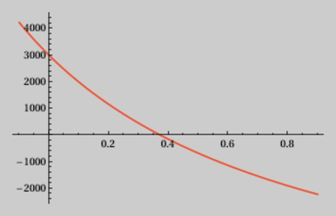

+++
date = 2023-07-29
title = "Internal Rate of Return Calculation"
description = "Deconstructing the math of investment: estimate the annualized rate of return with the IRR algorithm and its Rust implementation."
authors = ["Thomas Weitzel"]
[taxonomies]
tags = ["rust", "math"]
[extra]
math = true
image = "banner.jpg"
+++

The internal rate of return (IRR) is a potent financial measure used in financial analysis, accounting, and portfolio management to gauge the profitability of investments.
It's like the heartbeat of an investment -- an indicator of health, the higher it is, the better the investment.
This powerful tool can help investors compare different investment options, assisting in making informed decisions about where to allocate their capital.
Especially when cash flows are irregular, as often is the case in real-world scenarios, IRR becomes invaluable.
This article will first explain the concept and calculations behind IRR and then demonstrate how to implement an IRR algorithm in Rust.

## IRR vs. XIRR terminology

The IRR is the rate of return that makes the net present value (NPV) of all cash flows (both positive and negative) from a particular investment equal to zero.
It's sometimes used for cash flows at regular, usually annual, intervals.
I will not make this assumption in this article.
While Microsoft uses the name XIRR for its Excel function, I will use the term IRR throughout this article, even though the cash flows do not occur at regular intervals.

## Example data and validation

A crucial part of implementing a financial algorithm like IRR is validation -- that is, making sure that your algorithm is producing correct and expected results.
One effective way to validate your implementation is by comparing its outputs to those of [Microsoft Excel's XIRR function](https://support.microsoft.com/en-gb/office/xirr-function-de1242ec-6477-445b-b11b-a303ad9adc9d).
I will use the data from the Excel example.
Using Excel's XIRR function to compute the internal rate of return for this specific data set yields a result of $37.34\\%$.

| $\textbf{i}$ | ISO Date $\textbf{d}$ | Years since first cash flow $\textbf{y}$ | Payment $\textbf{p}$ |
|-------------:|-----------------------|-----------------------------------------:|---------------------:|
|            1 | 2008-01-01            |                                   0.0000 |              -10,000 |
|            2 | 2008-03-01            |                                   0.1644 |                2,750 |
|            3 | 2008-10-30            |                                   0.8301 |                4,250 |
|            4 | 2009-02-15            |                                   1.1260 |                3,250 |
|            5 | 2009-04-01            |                                   1.2493 |                2,750 |


## How IRR works

The IRR is calculated by finding the rate of return that would make the net present value (NPV) of an investment equal to zero.
The NPV is the sum of the present values of all future cash flows from an investment.
The derivative of the NPV is used to find the IRR.
The derivative of the NPV is the rate of change of the NPV with respect to the interest rate.

The IRR algorithm is an instance of the [Newton-Raphson method](https://en.wikipedia.org/wiki/Newton%27s_method),
which is a root-finding algorithm that produces successively better approximations to the roots (or zeroes) of a real-valued function.
To calculate the IRR, you need an array with pairs of data: one is the date of a cash flow, and the other is its payment amount.
You also need an initial guess for the IRR rate, which is often set as $10\\%$ or $0.1$.

Here's the general process of the algorithm:

1. **Compute the net present value (NPV)**: The NPV is calculated by summing the present values of the individual cash flows.
1. **Compute the derivative of the NPV**: The derivative of the NPV with respect to the rate is created by differentiating the NPV formula and summing these values. 
1. **Update the guess**: The next guess for the rate is calculated by subtracting the ratio of the NPV to its derivative from the current guess.
1. **Iterate until convergence**: These steps are repeated until the change in guesses is below a certain tolerance, or until a maximum number of iterations is reached.
   At this point, the guess for the rate is considered to be the IRR.


## Compute the net present value (NPV)

Here, $y_i$ represents the number of years that have passed since the first cash flow,
calculated as the difference in days between the date of the $i$-th cash flow $d_i$ and the date of the first cash flow $d_1$,
divided by 365 (days in one year).
I have pre-calculated it in the table above:

$$y_i = \frac{d_i - d_1}{365}$$

The NPV is the sum of all payments, where the correct interest rate $irr$ is applied.
Its value is 0 after all transaction have been concluded:

$$\mathit{NPV} = \sum_{i = 1}^{m} \frac{p_i}{(1 + irr)^{y_i}}$$

When you [plot](https://www.wolframalpha.com/input?i=plot+-10000*%281%2F%281+%2B+x%29%5E%280.0000%29%29+%2B+2750*%281%2F%281+%2B+x%29%5E%280.1644%29%29+%2B+4250*%281%2F%281+%2B+x%29%5E%280.8301%29%29+%2B+3250*%281%2F%281+%2B+x%29%5E%281.1260%29%29+%2B+2750*%281%2F%281+%2B+x%29%5E%281.2493%29%29+from+x%3D-0.1+to+0.9) the NPV function as a function of $irr$,
you are essentially varying the interest rate and observing how it affects the NPV.
Here's what you see on the graph below, which plots the NPV as a function of the rate with the values from the table above:

- **X-axis**: The x-axis represents the interest rate $irr$.
  It typically ranges from $0\\%$ to a reasonable upper limit, depending on the context of your problem.
- **Y-axis**: The y-axis represents the net present value NPV.
  It's the cumulative sum of the discounted cash flows according to the given formula.
- **Shape of the curve**: The curve of the NPV function will generally be downward-sloping.
  This is because as you increase the interest rate $irr$, the present value of future cash flows decreases.
  Higher interest rates mean that future cash flows are being discounted more heavily, which reduces their present value.
- **Break-even point**: There will be a point on the graph where the NPV curve intersects the x-axis.
  It's where our $irr$ satisfies the condition $\mathit{NPV} = 0$.
  For our data, it is somewhere between $0.35$ and $0.40$, or $35\\%$ and $40\\%$.

<div class="light-dark-image">
  
  
</div>

The above formula is a sum of function terms.
Applying the [superposition principle](https://en.wikipedia.org/wiki/Superposition_principle),
we can split the sum into individual function terms, which look all the same.
For each cash flow, we have a function term, which is the present value of the cash flow.
The important part is that we can apply this principle to the NPV function **and** the derivative of the NPV function.

With $irr$ written as $x$, each function term looks like this, where $p_i$ and $y_i$ are just constants.
$f_i(x)$ represents the NPV for a single cash flow, the $i$-th one:

$$f_i(x) = \frac{p_i}{(1 + x)^{y_i}}$$

The amount $p_i$ is discounted in the NPV calculation to reflect the time value of money. Here's an explanation for why that's done:

- **Time value of money**: Money available today is worth more than the same amount in the future because of its potential earning capacity.
  This core principle of finance holds that, provided money can earn interest, any amount of money is worth more the sooner it is received.
- **Discounting future cash flows**: In the context of the internal rate of return (IRR) and net present value (NPV), this principle is applied to future cash flows.
  The $p_i$ represents a payment (cash flow) at some future date. To compare this future value to present values,
  it needs to be discounted back to its value in today's terms.
- **The discount factor**: The expression $\frac{1}{(1 + x)^{y_i}}$ serves as a discount factor, where $x$ is the internal rate of return, and $y_i$ is the number of years that have passed since the first cash flow.
  This factor is derived from the formula for compounding interest in reverse (discounting rather than compounding).
- **Sum of discounted payments**: The NPV is the sum of these discounted payments. By discounting each future cash flow back to its present value,
  the NPV provides a consistent basis for comparing the value of cash flows across different time periods.
- **Understanding the equation**: The equation $f_i(x) = \frac{p_i}{(1 + x)^{y_i}}$ represents the present value of the $i$-th cash flow.
  It shows how each cash flow is discounted back to present value terms using the discount factor.

Discounting the $p_i$ in the NPV calculation allows for a proper comparison of cash flows across different time periods,
taking into account the time value of money and the specific internal rate of return (IRR) required from the investment.
It ensures that future cash flows are appropriately weighed against the potential earning capacity of money in the present.

### But what happens if ...

The expression $(1 + x)^{y_i}$ can become a problem if $x < -1$ (less than $-100\\%$), because raising a negative number to a non-integer power will result in a complex number.
Within the realm of real numbers, this operation is undefined.
For example, consider a case where $x = -1.1$ and $y_i$ is a floating point number like $0.4$.
Then, $(1 + x)$ will be negative, and raising it to the $y_i$ power [produces a complex value](https://www.wolframalpha.com/input?i=%281+-+1.1%29%5E%280.4%29):
${(1 - 1.1)}^{0.4} \approx 0.12 + 0.38 i$

In the context of finance and the calculation of IRR, it doesn't make sense to have complex numbers as they don't have a practical interpretation in terms of cash flows or discount rates.
Therefore, you would typically ensure that the rate $x$ stays within the range where the calculation remains within the realm of real numbers.
If you're working with cash flows and discount rates, you may want to either avoid or handle situations where $x < -1$ by constraining the value of $x$ within a reasonable range or taking some other specific action if $x$ falls outside that range.

In practice, it's rare that you would come across this scenario.

## Compute the derivative of the NPV

We can now apply the [basic differentiation rules](https://www.wolframalpha.com/input?i=derivative+of+a+%2F+%28%281+%2B+x%29%5Eb%29) to get the derivative of $f_i(x)$.
It represents the derivative of the NPV for a single cash flow, also the $i$-th one:

$$f_i'(x) = \frac{-y_i \cdot p_i}{(1 + x)^{y_i + 1}}$$

## Update the guess

The [Newton-Raphson method](https://en.wikipedia.org/wiki/Newton%27s_method) is an iterative process used to locate the roots of a differentiable function, i.e. a solution for $x$ where $f(x) = 0$.
The method begins with an initial estimate $x_n$, which is then refined into a more accurate guess, $x_{n+1}$.
This stage is where the NPV and its derivative come into play.
Instead of solely employing $f_i(x_n)$ and $f_i'(x_n)$ for a single cash flow, we incorporate all the cash flows by adding up the NPV terms and derivative terms respectively:

$$x_{n+1} = x_{n} - \frac{\sum_{i = 1}^{m} f_i(x_n)}{\sum_{i = 1}^{m} f_i'(x_n)} $$

## Iterate until convergence

Instead of improving the result indefinitely, you stop when the difference between $x_n$ and $x_{n+1}$ is smaller than or equal to a given $\epsilon$, i.e. $\left| x_n - x_{n+1} \right| \le \epsilon$.
It's usually a very small number, like $0.000001$ ($1.0 e^{-6}$).
This is the value used in Microsoft Excel's XIRR function.

It's also worth noting that despite using the exact derivative, the IRR algorithm is still an approximation method.
It may not always converge to a solution, especially for cash flow series that have multiple changes in sign.
In these cases, it may be necessary to provide a good initial guess for the rate, or to use a different method to compute the internal rate of return.

## Implementation in Rust

Let's move towards translating our theoretical understanding into a concrete implementation using Rust.
We'll focus on implementing the IRR calculation algorithm by applying the findings and formulas mentioned in the previous sections.
The final output should be close to Excel's XIRR function result within an acceptable tolerance range.

```rust
// We use the chrono crate for date handling: https://docs.rs/chrono/latest/chrono
use chrono::prelude::*;

// Function to calculate the number of days between two dates
fn days_between(start_date: NaiveDate, end_date: NaiveDate) -> i64 {
    // Calculate the duration between the two dates
    let duration = end_date.signed_duration_since(start_date);

    // Return the duration in days
    duration.num_days()
}

// Main function to calculate the internal rate of return
fn calculate_irr(transactions: &[(f64, f64)], initial_guess: f64) -> f64 {
    // Start with initial guess for the IRR
    let mut x = initial_guess;
    const MAX_TRIES: usize = 100;
    const EPSILON: f64 = 1.0e-6;

    // Loop until a maximum number of iterations is reached
    for _ in 0..MAX_TRIES {
        // Calculate NPV and its derivative for each cash flow and sum them up
        let (fx, dfx) = transactions.iter()
            .map(|(years, amount)| {
                let fx = amount / (1_f64 + x).powf(*years);                  // NPV of the cash flow
                let dfx = (-years * amount) / (1_f64 + x).powf(years + 1.0); // Derivative of NPV                                                       
                (fx, dfx)                                                    // Return both values for a single cash flow
            })
            // Sum up all NPVs and derivatives for all cash flows (reduce to a tuple of two sums)
            .fold((0_f64, 0_f64), |(fx_acc, dfx_acc), (fx, dfx)| (fx_acc + fx, dfx_acc + dfx));

        // Calculate the new guess
        let new_x = x - fx / dfx;

        // Calculate the difference between the new and the old guess
        let epsilon = (new_x - x).abs();

        // If the difference is smaller than or equal to the tolerance, we are done
        if epsilon <= EPSILON {
            return x;
        }

        // Continue the loop with the new guess
        x = new_x;
    }

    // Return a non-number if the algorithm didn't converge (see "Iterate until convergence" in article)
    f64::NAN
}

// Define the main function and our example transactions
fn main() {
    // Example from Microsoft Excel documentation:
    // https://support.microsoft.com/en-gb/office/xirr-function-de1242ec-6477-445b-b11b-a303ad9adc9d
    // The internal rate of return is 0.373362535 or 37.34%
    let cashflows = vec![
        (NaiveDate::from_ymd_opt(2008,  1,  1).unwrap(), -10_000.00),
        (NaiveDate::from_ymd_opt(2008,  3,  1).unwrap(),   2_750.00),
        (NaiveDate::from_ymd_opt(2008, 10, 30).unwrap(),   4_250.00),
        (NaiveDate::from_ymd_opt(2009,  2, 15).unwrap(),   3_250.00),
        (NaiveDate::from_ymd_opt(2009,  4,  1).unwrap(),   2_750.00),
    ];
    // Pre-calculate the years since first cash flow for each cash flow
    let transactions: Vec<(f64, f64)> = cashflows.iter()
        .map(|(date, amount)| (days_between(cashflows[0].0, *date) as f64 / 365.0, *amount))
        .collect();

    // Call our IRR calculation function and print the result
    // Expected result is 37.34%
    println!("IRR with Newton-Raphson: {:.2}%", calculate_irr(&transactions, 0.1) * 100.0);
}
```

The `calculate_irr` function is where the heart of our IRR calculation lives.
It starts by defining the initial guess for the IRR, then enters a loop that calculates the new guess, checks for convergence, and continues the loop if not converged.
Finally, if the algorithm fails to converge, it returns a non-number.
The main function uses an example transaction set and calls our `calculate_irr` function.

## Bonus: implementation in JavaScript

JavaScript runs natively in all modern browsers and is the _lingua franca_ of the web.
By translating the Rust code into JavaScript, the IRR calculation will be easily usable on virtually any device, regardless of operating system or hardware.
This way, it should be possible to use it in a web application, or even in a mobile app using a framework like [React Native](https://reactnative.dev).
Maybe you want to write a financial app that runs on iOS, Android, and the web?

```js
// Function to calculate the number of days between two dates
function daysBetween(start, end) {
  const millisecondsPerDay = 1000 * 60 * 60 * 24;
  const millisBetween = end.getTime() - start.getTime();
  return millisBetween / millisecondsPerDay;
}

// Main function to calculate the internal rate of return
function calculateIRR(transactions, initialGuess = 0.1) {
  // Start with initial guess for the IRR
  let x = initialGuess;
  const MAX_TRIES = 100;
  const EPSILON = 1.0e-6;

  // Loop until a maximum number of iterations is reached
  for (let tries = 0; tries < MAX_TRIES; tries += 1) {
    // Calculate NPV and its derivative for each cash flow and sum them up
    const { fxs, dfxs } = transactions
      .map((tx) => {
        const fx = tx.amount / ((1.0 + x) ** tx.years);                      // NPV of the cash flow
        const dfx = (-tx.years * tx.amount) / ((1.0 + x) ** (tx.years + 1)); // Derivative of NPV
        return { fx, dfx };                                                  // Return both values for a single cash flow
      })
      // Sum up all NPVs and derivatives for all cash flows (reduce to an object with two sums)
      .reduce((acc, obj) => ({ fxs: acc.fxs + obj.fx, dfxs: acc.dfxs + obj.dfx }), { fxs: 0, dfxs: 0 });

    // Calculate the new guess
    const xNew = x - fxs / dfxs;

    // Calculate the difference between the new and the old guess
    const epsilon = Math.abs(xNew - x);

    // If the difference is smaller than or equal to the tolerance, we are done
    if (epsilon <= EPSILON) {
      return x;
    }

    // Continue the loop with the new guess
    x = xNew;
  }

  // Return a non-number if the algorithm didn't converge
  return NaN;
}

// Example from Microsoft Excel documentation:
// https://support.microsoft.com/en-gb/office/xirr-function-de1242ec-6477-445b-b11b-a303ad9adc9d
// The internal rate of return is 0.373362535 or 37.34%
const cashflows = [
  { date: new Date('2008-01-01'), amount: -10000.00 },
  { date: new Date('2008-03-01'), amount:   2750.00 },
  { date: new Date('2008-10-30'), amount:   4250.00 },
  { date: new Date('2009-02-15'), amount:   3250.00 },
  { date: new Date('2009-04-01'), amount:   2750.00 }
];
// Pre-calculate the years since first cash flow for each cash flow
const transactions = cashflows
  .map((cf) => ({ years: daysBetween(cashflows[0].date, cf.date) / 365, amount: cf.amount }));

// Call our IRR calculation function and print the result
// Expected result is 37.34%
console.log(`IRR with Newton-Raphson: ${(calculateIRR(transactions) * 100).toFixed(2)}%`);
```

## Conclusion

The internal rate of return (IRR) is an instrumental financial measure that helps investors compare and decide between different investment opportunities.
Calculating it can get complex due to irregular cash flows, making a detailed understanding of the underlying algorithm crucial.
This article dived into the mathematics behind IRR calculation and provided a concrete implementation using the Rust programming language.
Remember, IRR is not just a number but an insight into the potential of an investment, assisting you in making informed financial decisions.

If you have any questions, need further clarification, or want to give feedback: please let me know.
