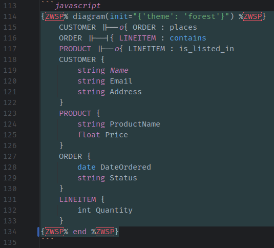

+++
date = 2023-09-26
title = "Diagrams with Mermaid"
description = "Discover Mermaid's Markdown-inspired syntax to craft diverse diagrams using simple text in your blog posts. Learn how to integrate and customize Mermaid diagrams."
authors = ["Thomas Weitzel"]
[taxonomies]
tags = ["diagram"]
[extra]
math = false
diagram = true
image = "banner.jpg"
+++

## What are Mermaid diagrams

[Mermaid](https://mermaid.js.org) is a syntax similar to Markdown where you can use text to describe and automatically generate diagrams.
With Mermaid, you can generate
[Flow charts](https://mermaid.js.org/syntax/flowchart.html),
[UML diagrams](https://mermaid.js.org/syntax/classDiagram.html),
[Pie charts](https://mermaid.js.org/syntax/pie.html),
[Gantt diagrams](https://mermaid.js.org/syntax/gantt.html),
[Entity Relationship diagrams](https://mermaid.js.org/syntax/entityRelationshipDiagram.html),
and more.

## An Entity Relationship diagram example


erDiagram
    CUSTOMER ||--o{ ORDER : places
    ORDER ||--|{ LINEITEM : contains
    PRODUCT ||--o{ LINEITEM : is_listed_in
    CUSTOMER {
        string Name
        string Email
        string Address
    }
    PRODUCT {
        string ProductName
        float Price
    }
    ORDER {
        date DateOrdered
        string Status
    }
    LINEITEM {
        int Quantity
    }


## Using Mermaid in your blog post

The diagram shortcode allows you to easily embed Mermaid diagrams in your blog posts, with an option to configure its appearance.

### Basic Usage
To use the shortcode in your blog post, you would use the following format:

```javascript
{​% diagram() %​}
Your Mermaid diagram code here

```

Replace *Your Mermaid diagram code here* with your actual Mermaid diagram code.

To load the necessary JavaScript to render the Mermaid diagram, you need to enable it in the front matter of your blog post by setting the value for `extra.diagram` to `true`:

```ini
+++
[extra]
diagram = true
+++
```

### Configuring the Appearance
The shortcode supports an optional `init` parameter, that allows you to specify configuration options for Mermaid,
particularly changing the appearance of the diagrams through the theme.

For example, to apply the `forest` theme:

```javascript
{​% diagram(init="{'theme': 'forest'}") %​}
Your Mermaid diagram code here

```

### Providing init Configuration
When using the `init` parameter, the configuration should be a string wrapped in double quotes.
Inside this string, use single quotes for keys and values.

Here's a more advanced example with multiple configuration options:

```javascript
{​% diagram(init="{'theme': 'forest', 'themeVariables': {'primaryColor': '#FF0000'}}") %​}
Your Mermaid diagram code here

```

In this example, we're using the `forest` theme and changing the primary color to red (`#FF0000`).

**Note**: Ensure that you use single quotes inside the double quotes for the configuration to work correctly.

### Putting it all together
Use the shortcode by enclosing your Mermaid diagram code with `{​% diagram() %​} ... `.
To change the look of the Mermaid theme, provide values for the init parameter.
Always enclose the init value with double quotes, and use single quotes inside the configuration string.
With this shortcode in place, integrating and customizing Mermaid diagrams in your blog posts becomes a breeze!

## Explaining Mermaid diagram code

Here is how the diagram rendered above is embedded in this blog post as a code block.
Because it is the same code as the diagram above, extra care has to be taken to prevent Mermaid from rendering it as a diagram.

```javascript
{​% diagram(init="{'theme': 'forest'}") %​}
    CUSTOMER ||--o{ ORDER : places
    ORDER ||--|{ LINEITEM : contains
    PRODUCT ||--o{ LINEITEM : is_listed_in
    CUSTOMER {
        string Name
        string Email
        string Address
    }
    PRODUCT {
        string ProductName
        float Price
    }
    ORDER {
        date DateOrdered
        string Status
    }
    LINEITEM {
        int Quantity
    }

```

If you want to mention it in your blog post text,
make sure to include a zero-width space (`ZWSP` or `U+200B`) after the opening and before the closing curly braces to prevent Mermaid from rendering it. 


